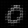

# Orthogonal Autoencoder

Autoencoder with orthogonalization as a regularization loss for latent space vectors.

## Requirements

1. numpy
2. tensorflow
3. matplotlib (optional)

## Latent space demo

